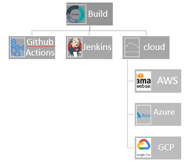

[](https://github.com/Aduzona/Cloud-Native-Pytest-Tips-December-2022/actions/workflows/build.yml)

# Cloud-Native-Pytest-Tips-December-2022

Pytest repo, covering best practices
Make Projects more reproducable, set it up on different environment.

Avoid stating with Laptop first:  Starting with a cloud based environment like.
* Github codespaces.
* AWS Cloud9
  


**Scaffold**
Skaffold handles the workflow for building, pushing and deploying your application, allowing you to focus on what matters most: writing code [scaffold.dev](https://skaffold.dev/)

**Key Terms in Testing**

* requirements: contains list of packages and versions, this is 100% reproducable.
* Makefile: it is a linux based file,has commands that automates tasks.
* Docker Containers: 
  * Dockerfile is a plain text file that defines what will be in run time when you do buil the docker format container.
  * Container: Includes Runtime and code/software.
These are done in Virtual env or/and docker, this is to reproduce same structure.

**Kaizen== Devops**

Means continuous Improvement, You can be in 3 states: 

* Degrading: No automation
* Same: remains in same state
* Improving: When automated, updates could be performed.

## Project Stucture

* Makefile `touch Makefile`
* requirements `touch requirements.txt`
* test file `test_hello.py`
* script to test `hello.py`
* Check python version `which python`
* Check Number of libraries installed `pip freeze | wc -l` this is usually much.
* Take a look at the library `pip freeze | wc -l`
* To avoid conflict for real world production environment. create virtual environment.

## Note on Virtualenv

1. Codespaces is a debian based system, so we will use `virtualenv ~/.venv`. we added it in the home directory.
2. Edit bashrc file `vim ~/.bashrc` , do `shift+g` to get to the bottom of the file, type `o` to open a new line. and put in `source ~/.venv/bin/activate` press `Esc` key and save by typing `:wq`. 
3. Open a new shell to automatically source the virtual environment.
4. Verify the right python `which python` and try `pip freeze | wc -l`. check now no package.
5. Now we can start building 100 reproducable system.

## Makefile

Upgade pip and install libraries in requirements.txt
```Makefile
install:
	pip install --upgrade pip &&\
		pip install -r requirements.txt
```
run test file here it is `test_hello.py`
```Makefile
test:
	python -m pytest -vv test_hello.py
```

format python codes with black
```Makefile
format:
	black *.py
```
Lint which [pylint](https://ipwithease.com/what-is-pylint-python-programming-tool/), disable recommendations and configurations which are too noisy
only keep warning which is useful.
```Makefile
lint:
	pylint --disable=R,C hello.py
```

put them together according to execution steps
```Makefile
all: install lint test format
```

* See all the things in your Makefile `make ` press tab. thus make space tab.
* run `make install`
* check the history of the command you have run by runing `history`.
  * then find the line you want to run e.g line 12. `!12`
  * or If not there then run `pip freeze | wc -l`
* check libraries installed `pip freeze`
* copy the library versions to `requirements.txt`
* test it again by typing in `make install`
Then Add Libraries to requirements file

Then checkin the code.
```
git status
git add *
git commit -m "message"
git push
```

* Setup the Build system to actually get the installation step running.

## Build

**Build system e.g Github Actions:**

* **Cloud Native Approach**
* Test installations process (used codespaces)
  * run the Makefile commands
* Test in many different environments:
  * AWS Cloud9
  * GCP
  * Azure

We will take the installation steps and expand them to other environments.
Make new build system. We start with github actions.
You can take a look at some example of deploy process

* click Actions button.
* click Pylint under continuous Integration.
* click configure, start commit and commit.


There are 2 steps in this `build.yml` install step and lint step.
In codespaces or your favourite environment.
* Enter the github workflow `cd .github/workflows`
* We renamed the file to build. `mv pylint.yml build.yml` or `git mv pylint.yml build.yml`
* In `build.yml` change name: to `Build`
* We already have a Makefile,therefore in name:`install dependencies`,
  * Swap the run: to `make install` e.g. 
  before
  ```yml
    - name: Install dependencies
      run: |
        python -m pip install --upgrade pip
        pip install pylint
  ```
  
  after
  ```yml
    - name: Install dependencies
      run: |
        make install
  ```
  
* copy pylint from `build.yml` to Makefile lint:
  copy `pylint $(git ls-files '*.py')`
  ```yml
    - name: Analysing the code with pylint
      run: |
        pylint $(git ls-files '*.py')
  ```
  to this and add extra `$` sign
  ```Makefile
  lint:
	    pylint --disable=R,C $$(git ls-files '*.py')
  ```
  * Change `build.yml` under pylint section to `make lint`
    ```yml
    - name: Analysing the code with pylint
      run: |
        make lint
    ```
We have now kept all the complexity abstracted to the Makefile

## Test the lint

using `hello.py`, write a function using `make lint`


## Testing for Multi-Cloud

* AWS CloudShell
	Cloudshell is free so this is a cost effective  way of configuring your app for deployment
	* First activate ssh key see [SSH](https://github.com/Aduzona/python-for-devops-december-2022) 
	* Or Use https but use Personal access tokens (classic)(PAT) as password.(you can create PAT in github settings)
```sh

git clone git@github.com:Aduzona/Cloud-Native-Pytest-Tips-December-2022.git
python3 -m venv ~/.Cloud-Native-Pytest-Tips-December-2022
source ~/.Cloud-Native-Pytest-Tips-December-2022/bin/activate
which python
cd Cloud-Native-Pytest-Tips-December-2022
git pull
make install
make lint
```

setup testing for the python version we are on, e.g. python 3.7
```sh
vim .git
vim .github/workflows/build.yml
```
now add another python version to `build.yml`
```yml
matrix:
  python-version:["3.7","3.8","3.9","3.10"]
```
```sh
git status
git add .github/workflows/build.yml
git commit -m "adding 3.7 python"
```
if asked for congiguration
```sh
git config --global user.email "****@gmail.com"
git config --global user.name "aduzona"
git commit -m "adding 3.7 python"
git push
```

if you use https

```
username: aduzona
password: get your personal access token
```
* Cloud9


### AWS Cloud9

using https

```sh
git clone https://github.com/Aduzona/Cloud-Native-Pytest-Tips-December-2022.git
cd Cloud-Native-Pytest-Tips-December-2022
python3 -m venv ~/.venv
vim ~/.bashrc
```

inside the vim, press i to insert, :q to quit, :wq to save and quite
```
#source virtualenv
source ~/.venv/bin/activate
```

* open new terminal
* Type `which python` here it is python3
* Type `python3` to see the python version you are working with, i worked with `Python 3.7.15` then type `exit()`
* change directory to `Cloud-Native-Pytest-Tips-December-2022` and type `make install`
* run `make lint`.

## References

* [Initialize Makefile](https://github.com/noahgift/github-actions-pytest/blob/master/Makefile)
